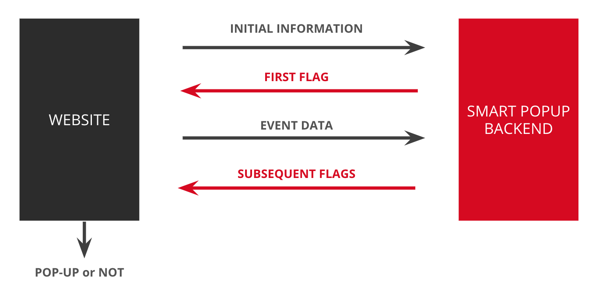

# Samurai Technology

This is a project of [Samurai Technology](http://samurai.technology). Contact us at [hi@samurai.technology](mailto:hi@samurai.technology).

## Smart Popup

Smart Popup provides an advice whether to show or not a pop-up. The advice is based on ML models trained on website's 
users activity data. Smart Popup currently supports 2 models:
- ``Initial model``: model based on user initial data, which can be recorded when a user enters a website
- ``Activity model``: model based on initial model data and user activity events

### Data

Production models of Smart Popup are not open sourced as they are created based on a client's data. Dummy models are 
provided for test and tutorial purposes.

### Run with custom models

To run Smart Popup with custom models:
1. Serialize your models with directory ``pickle``.
2. Configure path to serialized models in ``App/config.ini`` file (MODELS)
3. Register deserialized models in *ModelsRegistry* before starting the server.
4. *Optional*: populate database with custom data (constants), for instance: discrete values from model's input variable 
   space (e.g. ``device_categories = ["desktop", "mobile", "tablet"]``). See ``tests/dbPopulator/DBPopulator.py`` 
   for an example. This data can be used while utilizing the models during the request.
5. Provide predictors for *initial* and *activity* requests. Predictor is a function from data populated in 
   point 3., request body and *ModelsRegistry* into an advice for the request. Register predictors in ``PredictorsRegistry`` 
   and use them in ``DecisionService``. ``Predictor.predict(...)`` should be a pure function. See ``predictors`` package 
   for an example.

### Run Smart Popup backend

1. Create docker network: ``./bin/docker-create-network.sh``
2. Create backend image: ``./bin/docker-build-backend.sh``
3. Run database: ``./bin/docker-run-database.sh``
4. Run backend: ``./bin/docker-run-backend.sh``

Server will be available at ``localhost:8888``.

### Smart Popup usage

Smart Popup can be used to update a flag deciding whether to show a popup to a current website's user. Workflow schema:

### Development

While installing new dependencies, remember to update ``app/requirements.txt`` file.
